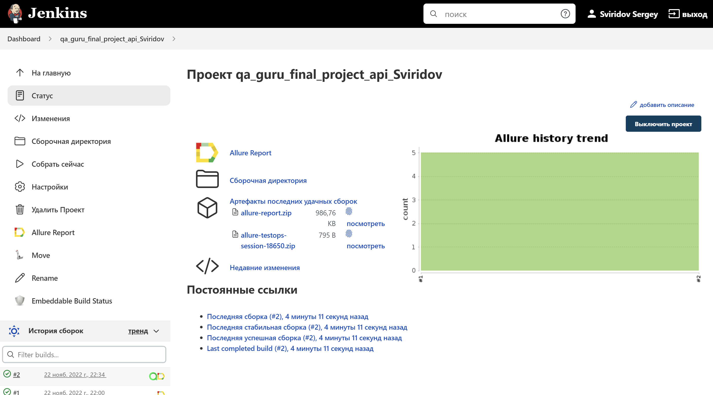
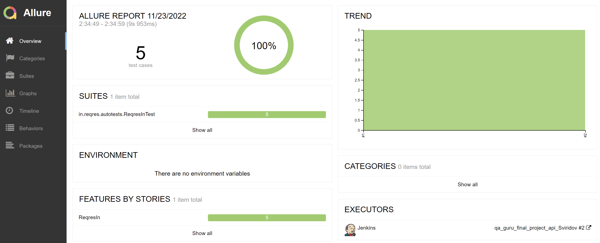
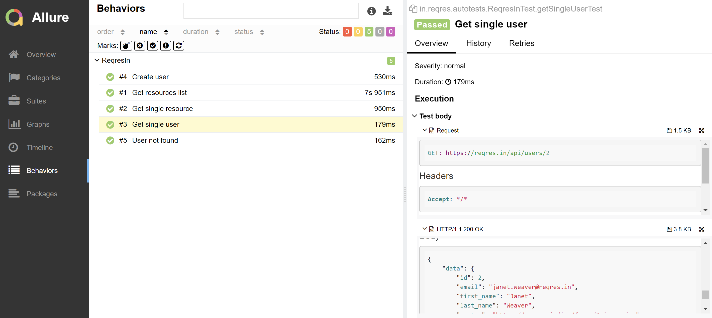
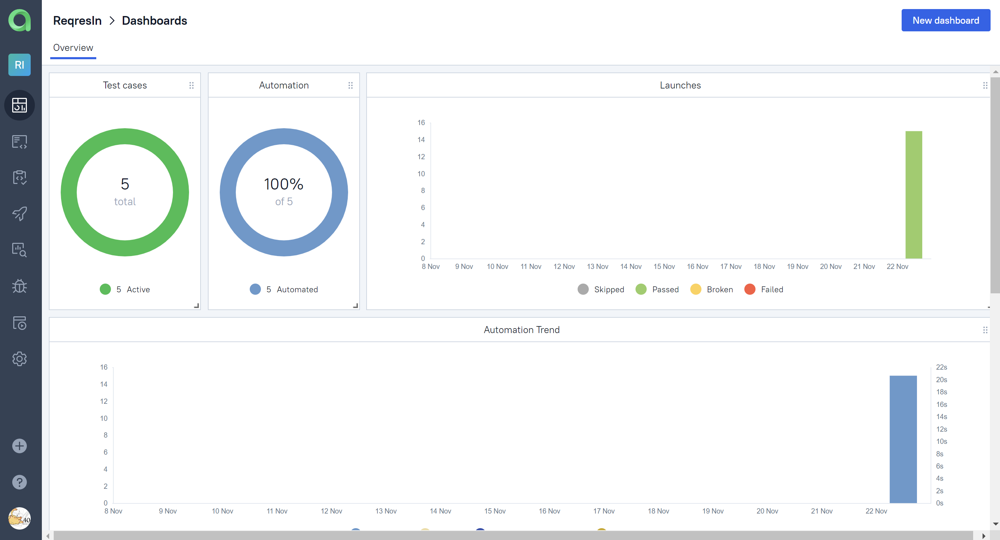
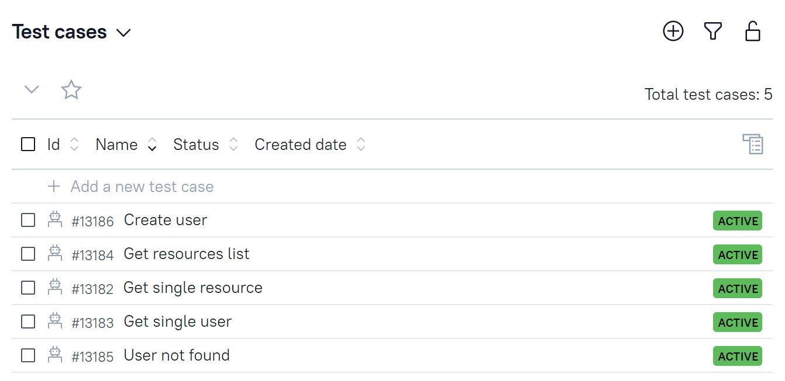
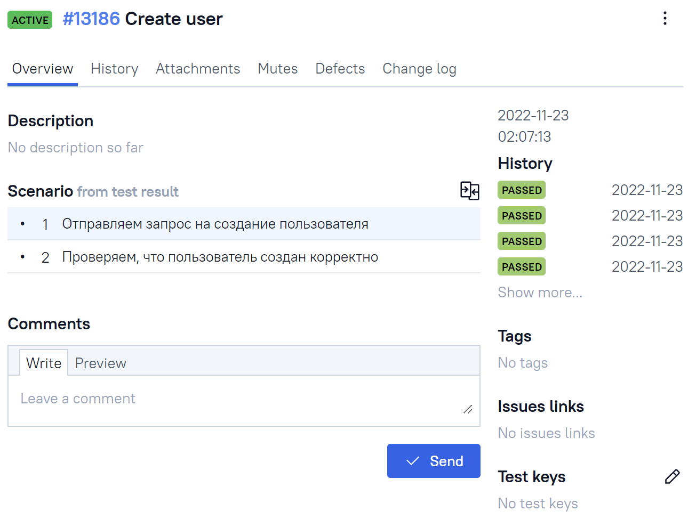
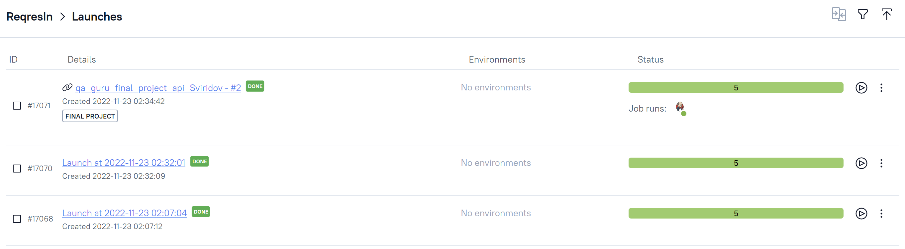
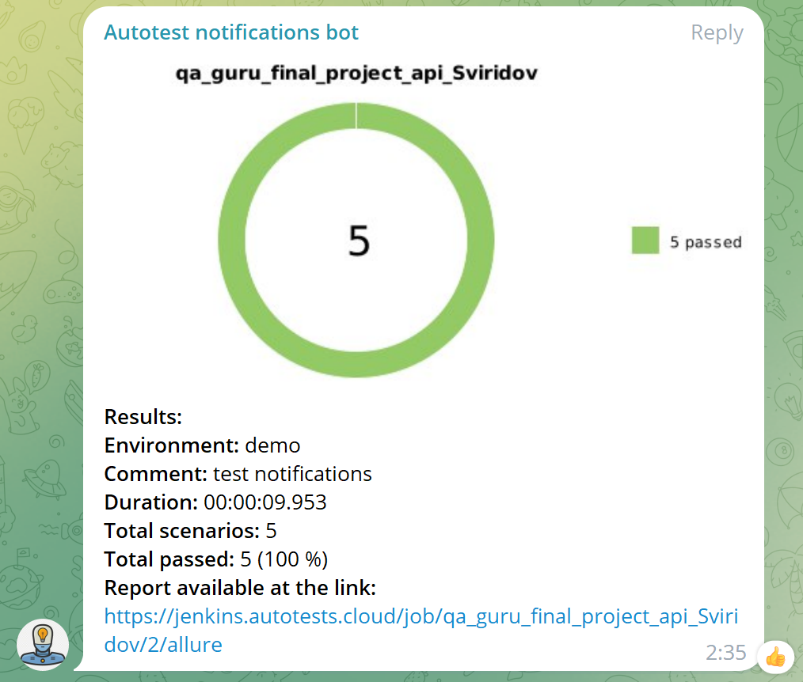

# Проект по автоматизации тестирования сервиса Reqres
> <a target="_blank" href="https://reqres.in/">Ссылка на портал</a>

## :page_with_curl: Содержание:

- [Использованный стек технологий](#computer-использованный-стек-технологий)
- [Запуск тестов](#rocket-запуск-тестов)
- [Сборка в Jenkins](#-сборка-в-jenkins)
- [Пример Allure-отчета](#-пример-allure-отчета)
- [Интеграция с Allure TestOps](#-интеграция-с-allure-testops)
- [Уведомления в Telegram с использованием бота](#-уведомления-в-telegram-с-использованием-бота)
- [Видео примера запуска теста в Selenoid](#-видео-примера-запуска-теста-в-selenoid)

## :wrench: Использованный стек технологий

<p align="center">


</p>

Автотесты написаны на <code>Java</code> с использованием <code>JUnit 5</code> и <code>Gradle</code>.
Также реализована сборка в <code>Jenkins</code> с формированием Allure-отчета и отправкой уведомления с результатами в <code>Telegram</code> после завершения прогона.
Тестовая модель хранится в Allure TestOps и формируется автоматически на основе выгрузки результатов автотестов.

## :boom: Запуск тестов

### Локальный запуск тестов
С параметрами по умолчанию
```
gradle clean test
```

### Запуск тестов на удаленном браузере

```
clean test
```

##  Сборка в Jenkins

> <a target="_blank" href="https://jenkins.autotests.cloud/job/qa_guru_final_project_api_Sviridov//">Ссылка на сборку в Jenkins</a>

<p align="center">

</p>

##  Пример Allure-отчета
### Overview

<p align="center">

</p>

### Результат выполнения теста

<p align="center">

</p>

##  Интеграция с Allure TestOps

> <a target="_blank" href="https://allure.autotests.cloud/project/1704/dashboards">Ссылка на проект</a>

Полная статистика о прохождении тестов, отчеты и результаты прогонов хранятся в Allure TestOps. Тестовая модель формируется автоматически на основе выгрузки результатов автотестов

### Примеры дашбордов

<p align="center">

</p>

### Список тест-кейсов

<p align="center">

</p>

### Описание тестового сценария

<p align="center">

</p>

### Список тестовых прогонов

<p align="center">

</p>

##  Уведомления в Telegram с использованием бота

После завершения сборки специальный бот, созданный в <code>Telegram</code>, автоматически обрабатывает и отправляет сообщение с отчетом о прогоне

<p align="center">

</p>
